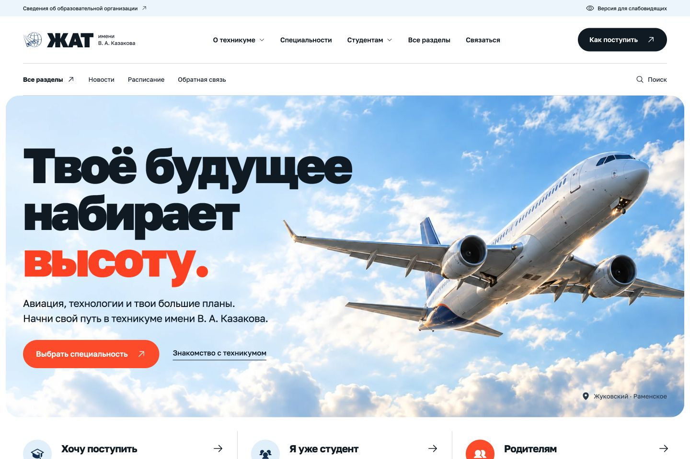
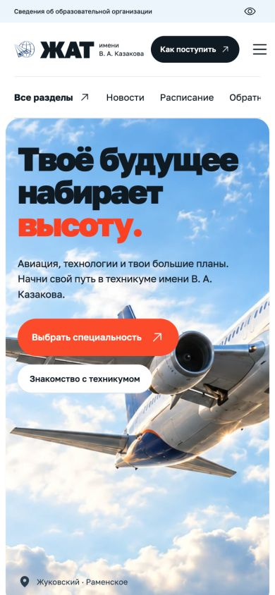
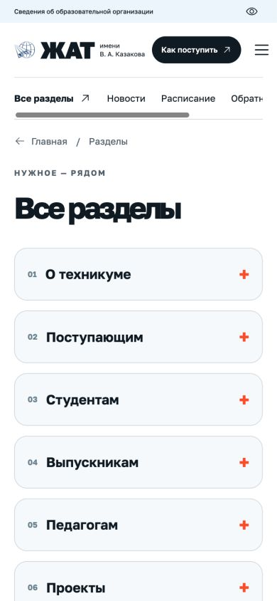
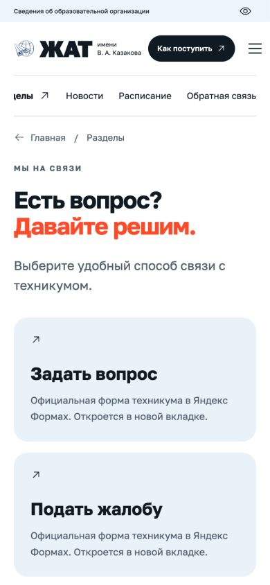

<div align="center">

# ЖАТ · Новый взгляд

**Твоё будущее набирает высоту.**

Современный сайт авиационного техникума имени В. А. Казакова —
с удобной навигацией, мобильным интерфейсом и настоящими материалами.

[](https://github.com/LITVA-HUB/zhat-redesign/actions/workflows/ci.yml)


[Возможности](#возможности) · [На телефоне](#на-телефоне) · [Запуск](#запуск) · [Устройство проекта](#устройство-проекта)

</div>



> Учебный проект **Литинского Дмитрия, группа ИП-6**. Независимый редизайн: официальный сайт [zhat.ru](https://zhat.ru/) не изменён. Репозиторий содержит приложение и сервер загрузки публичных материалов.

## Возможности

| Для посетителя | Что работает |
|---|---|
| Найти специальность | 11 направлений, фильтры, сроки и условия обучения |
| Подготовиться к поступлению | Информация приёмной комиссии, документы и контакты |
| Найти нужный раздел | 6 групп разделов: о техникуме, поступающим, студентам, выпускникам, педагогам и проекты |
| Читать материалы | 133 страницы с импортированным содержимым, собственные адреса и переходы |
| Следить за событиями | Свежие новости и архив из 3372 записей с поиском и пагинацией |
| Найти документ | Полнотекстовый поиск по основным материалам и поиск по заголовкам архива |
| Связаться с техникумом | Официальные формы вопроса и жалобы, отзывы, телефон и почта |
| Пользоваться с телефона | Адаптивная вёрстка, мобильное меню, контрастный режим, управление с клавиатуры |

Количество материалов отражает снимок от **21 сентября 2026 года**. Архивные статьи загружаются по запросу; весь архив не скачивается при открытии главной.

## На телефоне

<p align="center">
  
  
  
</p>

Небо и авиационная графика, крупная типографика, оранжевые акценты и простые маршруты к нужной информации. Шрифт — **Golos Text**, иконки — **Phosphor**.

## Запуск

Нужны **Node.js 22+**, npm и **Python 3.11+**.

```bash
git clone https://github.com/LITVA-HUB/zhat-redesign.git
cd zhat-redesign
npm ci
python3 -m venv .venv
source .venv/bin/activate
python3 -m pip install -r requirements-content.txt
npm run dev -- --host 127.0.0.1 --port 5175
```

Откройте **http://127.0.0.1:5175/**. На Windows виртуальное окружение активируется командой `.venv\Scripts\activate`.

Перед запуском копия публичных данных обновляется, если она старше часа. Если источник недоступен, используется сохранённая копия; дата обновления видна на сайте.

### Собранная версия

```bash
npm start
```

Команда обновляет устаревшие данные, собирает приложение и запускает его на **http://127.0.0.1:5176/**. Порт меняется переменной `PORT`.

| Команда | Назначение |
|---|---|
| `npm run build` | Собрать приложение без обращения к источнику |
| `npm run sync:content` | Обновить публичные страницы и индекс новостей |
| `npm run refresh` | Обновить данные и пересобрать сайт |
| `npm run test:content` | Проверить очистку HTML и целостность каталога |
| `npm run test:sites` | Проверить обработку статических маршрутов |

## Устройство проекта

```text
src/
  components/        интерфейс, страницы и навигация
  content.json       каталог публичных материалов
  data.js            сведения о специальностях
public/
  content/           отдельные страницы и поисковые индексы
  images/            изображения сайта
scripts/
  sync-content.py    импорт и очистка публичного HTML
  content-api.mjs    загрузка архивных статей по разрешённому каталогу
  serve.mjs          сервер собранного приложения
tests/               проверки контента и статического сервера
```

**React + Vite** отвечают за интерфейс. **Node.js + Python / Beautiful Soup** — за загрузку и очистку материалов. Скрипты и формы исходного сайта не исполняются в новом интерфейсе. API принимает только материалы из каталога, а не произвольные URL.

## Проверки

- Сборка приложения и 9 автоматических тестов.
- Проверка интерфейса на экранах 390 × 844 и 1440 × 960.
- Поиск, каталог, мобильное меню, архив, пагинация и загрузка старой статьи.
- Выборочная проверка ссылок на документы, расписание и официальные формы.

CI повторяет сборку и автоматические тесты при push и pull request. Отправка реальных обращений в ходе проверок не выполняется.

## Границы проекта

- Это **не официальный сайт** и не копия закрытой админки колледжа. Доступ к CMS, авторизация образовательных сервисов и публикация на домене колледжа не подключены.
- Документы, изображения расписания и формы обращений остаются у официальных провайдеров.
- Два исходных раздела с ошибкой 500 заменены местными оглавлениями. Недоступная страница рейтинга показывает возможность повторить запрос и открыть источник.
- Для архивных статей нужен Node/Python-сервер. **GitHub Pages и другой чисто статический хостинг не обеспечивают работу этого API.** Сохранённый Worker в `worker/` предназначен только для статических файлов.
- Синхронизация выполняется при запуске или по команде, а не непрерывно. Доступность внешних материалов зависит от источника.

## Материалы и авторство

**Автор проекта:** Литинский Дмитрий · ИП-6 · [@LITVA-HUB](https://github.com/LITVA-HUB).

Тексты, документы, логотип и фотографии техникума взяты из публичных разделов [zhat.ru](https://zhat.ru/). Права на них принадлежат соответствующим правообладателям; публичность этого репозитория не передаёт права на сторонние материалы. Авиационная обложка и иллюстрации направлений созданы с помощью генерации изображений и не выдаются за фотографии помещений техникума.

---

<div align="center">ЖАТ · Учиться. Пробовать. Быть собой.</div>
