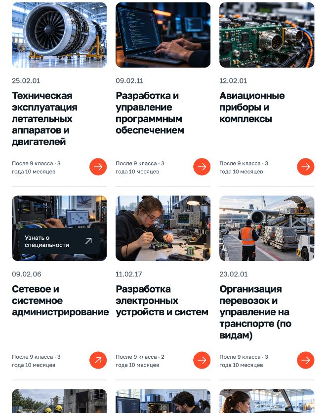
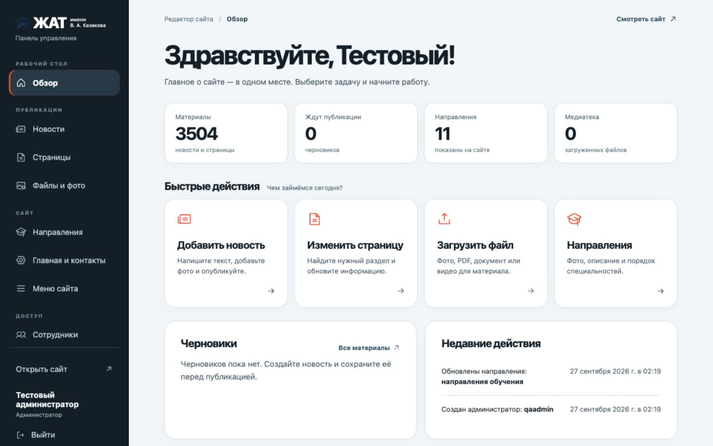
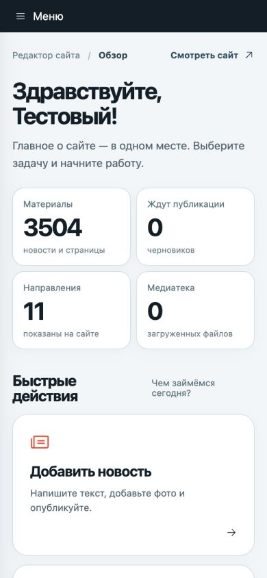
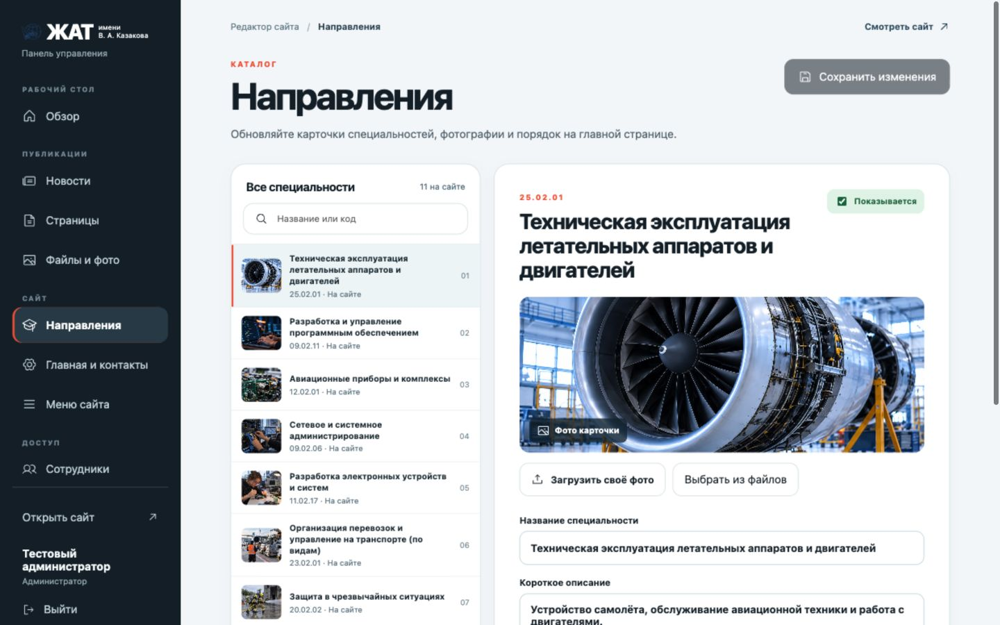

<div align="center">

# ЖАТ · Новый взгляд

**Твоё будущее набирает высоту.**

Современный сайт авиационного техникума имени В. А. Казакова —
с мобильной навигацией, публичными материалами и понятным редактором для сотрудников.

[](https://github.com/LITVA-HUB/zhat-redesign/actions/workflows/ci.yml)


[Возможности](#возможности) · [Редактор](#редактор-сайта) · [На телефоне](#на-телефоне) · [Запуск](#запуск) · [Устройство проекта](#устройство-проекта)

</div>


> Учебный проект **Литинского Дмитрия, группа ИП-6**. Независимый редизайн: официальный сайт [zhat.ru](https://zhat.ru/) не изменён. Репозиторий содержит приложение и сервер загрузки публичных материалов.

## Возможности

| Для посетителя | Что работает |
|---|---|
| Найти специальность | 11 направлений с отдельной реалистичной иллюстрацией для каждого, фильтры, сроки и условия обучения |
| Подготовиться к поступлению | Информация приёмной комиссии, документы и контакты |
| Найти нужный раздел | 6 групп разделов: о техникуме, поступающим, студентам, выпускникам, педагогам и проекты |
| Читать материалы | 142 страницы в каталоге, собственные адреса и переходы; три страницы источника сейчас недоступны |
| Следить за событиями | Свежие новости и архив из 3377 записей с поиском и пагинацией |
| Найти документ | Полнотекстовый поиск по основным материалам и поиск по заголовкам архива |
| Связаться с техникумом | Официальные формы вопроса и жалобы, отзывы, телефон и почта |
| Пользоваться с телефона | Адаптивная вёрстка, мобильное меню, контрастный режим, управление с клавиатуры |

Количество материалов отражает снимок от **27 сентября 2026 года**. Архивные статьи загружаются по запросу; весь архив не скачивается при открытии главной.



## Редактор сайта

Адрес панели — **`/#/admin`**. Это отдельный простой интерфейс вместо повседневной работы в Joomla:

| Действие | Как работает |
|---|---|
| Новости | Создать, добавить фото, сохранить черновик, посмотреть до публикации и опубликовать. Новая запись появляется первой на главной и в архиве. |
| Страницы | Найти старую страницу, исправить текст и сохранить прежний адрес; создать новую и поместить её в раздел. |
| Файлы | Загрузить изображение, PDF, Word, Excel или MP4 до 25 МБ и вставить в материал. |
| Направления | Изменить название, описание, категорию, срок, финансирование и фото; переставить или скрыть карточку. |
| Главная и контакты | Обновить текст первого экрана, адреса, телефоны и почту без правки кода. |
| Меню | Изменить порядок и состав пунктов шести разделов. |
| Сотрудники | Индивидуальные учётные записи администратора и редактора, смена пароля, отключение доступа. |
| Надёжность | Черновики не видны посетителям, есть история версий, журнал действий и резервная копия базы с файлами. |

Первый администратор создаётся по одноразовому коду, напечатанному при запуске сервера. База и загруженные файлы хранятся в **`.data/`** и не попадают в Git. Подробнее: [работа с редактором](docs/CMS-OPERATIONS.md).

<p align="center">
  
  
</p>



## На телефоне

<p align="center">
  
  
  
</p>

Небо и авиационная графика, крупная типографика, оранжевые акценты и простые маршруты к нужной информации. Шрифт — **Golos Text**, иконки — **Phosphor**.

## Запуск

Нужны **Node.js 24+**, npm и **Python 3.11+**.

```bash
git clone https://github.com/LITVA-HUB/zhat-redesign.git
cd zhat-redesign
npm ci
python3 -m venv .venv
source .venv/bin/activate
python3 -m pip install -r requirements-content.txt
npm run dev -- --host 127.0.0.1 --port 5175
```

Откройте **http://127.0.0.1:5175/**, а редактор — **http://127.0.0.1:5175/#/admin**. Код первого запуска виден в том же терминале. На Windows виртуальное окружение активируется командой `.venv\Scripts\activate`.

Перед запуском копия публичных данных обновляется, если она старше часа. Если источник недоступен, используется сохранённая копия; дата обновления видна на сайте.

### Собранная версия

```bash
npm start
```

Команда обновляет устаревшие данные, собирает приложение и запускает его на **http://127.0.0.1:5176/**. Порт меняется переменной `PORT`.

| Команда | Назначение |
|---|---|
| `npm run build` | Собрать приложение без обращения к источнику |
| `npm run sync:content` | Обновить публичные страницы и индекс новостей |
| `npm run refresh` | Обновить данные и пересобрать сайт |
| `npm run test:content` | Проверить очистку HTML и целостность каталога |
| `npm run test:sites` | Проверить обработку статических маршрутов |
| `npm run test:cms` | Проверить вход, публикацию, роли и загрузку файлов |
| `npm run cms:backup` | Сохранить базу и загруженные файлы в `.data/backups/` |

Для размещения Node-сервера с постоянным диском есть [Dockerfile](Dockerfile). Контейнер слушает порт 8080; том `/app/.data` должен сохраняться между обновлениями. Публичный доступ к редактору допускается только через HTTPS и обратный прокси. `CMS_TRUST_PROXY=1` включает Secure-cookie при заголовке `X-Forwarded-Proto: https`. Подробности запуска и восстановления — в [руководстве редактора](docs/CMS-OPERATIONS.md).

## Устройство проекта

```text
src/
  components/        интерфейс, страницы и навигация
  content.json       каталог публичных материалов
  data.js            сведения о специальностях
public/
  content/           отдельные страницы и поисковые индексы
  images/            изображения сайта
scripts/
  sync-content.py    импорт и очистка публичного HTML
  content-api.mjs    загрузка архивных статей по разрешённому каталогу
  cms-store.mjs      база редактора, версии и права
  cms-api.mjs        публикация, медиа и вход сотрудников
  serve.mjs          сервер собранного приложения и API
tests/               проверки контента и статического сервера
```

**React + Vite** отвечают за интерфейс. **Node.js + SQLite** — за редактор. **Python / Beautiful Soup** — за загрузку и очистку публичных материалов. Скрипты исходного сайта не исполняются в новом интерфейсе. Архивный API принимает только материалы из каталога, а не произвольные URL.

## Проверки

- Сборка приложения и проверки контента, статического сервера и редактора.
- Проверка интерфейса на экранах 390 × 844 и 1440 × 960.
- Поиск, каталог, мобильное меню, архив, пагинация и загрузка старой статьи.
- Выборочная проверка ссылок на документы, расписание и официальные формы.

CI повторяет сборку и автоматические тесты при push и pull request. Отправка реальных обращений в ходе проверок не выполняется.

## Границы проекта

- Это **не официальный сайт**. Новая панель работает на Node-сервере проекта, но не подключена к действующей Joomla, домену колледжа и закрытым образовательным сервисам.
- Скриншоты Joomla показывают состав старых инструментов, но не содержат базу материалов, файлы пользователей и настройки расширений. Для полного переноса закрытых данных потребуется экспорт Joomla 3 и медиа; [план переноса](docs/CMS-OPERATIONS.md#перенос-с-joomla-3) перечисляет нужное.
- Документы, изображения расписания и формы обращений остаются у официальных провайдеров.
- Два исходных раздела с ошибкой 500 заменены местными оглавлениями. Недоступная страница рейтинга показывает возможность повторить запрос и открыть источник.
- Для входа, публикации и архивных статей нужен Node/Python-сервер с постоянным диском. **GitHub Pages и чисто статический хостинг не обеспечивают работу CMS и API.** Сохранённый Worker в `worker/` предназначен только для статических файлов.
- Синхронизация выполняется при запуске или по команде, а не непрерывно. Доступность внешних материалов зависит от источника.

## Материалы и авторство

**Автор проекта:** Литинский Дмитрий · ИП-6 · [@LITVA-HUB](https://github.com/LITVA-HUB).

Тексты, документы, логотип и фотографии техникума взяты из публичных разделов [zhat.ru](https://zhat.ru/). Права на них принадлежат соответствующим правообладателям; публичность этого репозитория не передаёт права на сторонние материалы. Авиационная обложка и иллюстрации направлений созданы с помощью генерации изображений и не выдаются за фотографии помещений техникума.

---

<div align="center">ЖАТ · Учиться. Пробовать. Быть собой.</div>

## Полное меню и проверка источника

Все **79 пунктов шести разделов** открываются внутри сайта. Добавлены поиск по названиям разделов, навигация по темам, фильтр документов на каждой странице и официальные видеоматериалы с управлением воспроизведением. Пустые страницы источника содержат пояснение, связанные материалы и контакт техникума.

[Матрица всех разделов и недоступных файлов](docs/SECTION-COVERAGE.md) содержит результаты проверки 22 сентября 2026 года. Из 620 ссылок на официальные файлы и медиа 600 доступны; 20 возвращают ошибки и отмечены в интерфейсе с датой. Отсутствующие сведения не заменены вымышленными.

Повторная проверка: `npm run audit:sections`. Она обновляет отчёт и отметки доступности; `npm run sync:content` обновляет сами материалы. Проверка ссылок не отправляет формы и не скачивает видео целиком.

Проверено открытие всех 79 страниц в браузере, в том числе на ширине 390 px; поиск разделов, поиск документов и наличие видеоплеера. Внешние сервисы, содержание PDF и процедуры приёмной комиссии не заменяются локальным интерфейсом.
